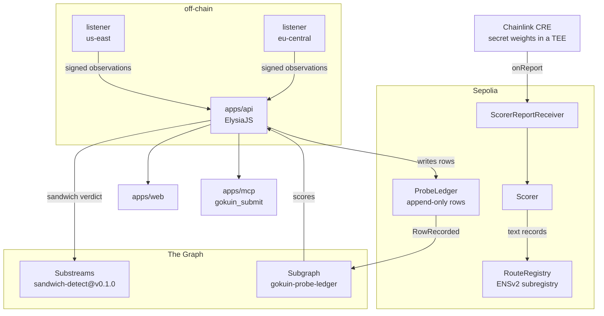

# 極印 Gokuin

**Best execution for transaction promises.**

*Gokuin* (極印) is the assayer's mark struck into metal to certify what it actually is. The same word carries a second sense in Japanese: to be *gokuin*-stamped is to be branded permanently, with a record that cannot be lifted off. Both meanings are the product.

Every route you can send an Ethereum transaction through sells a promise: private, unsandwiched, fast, rebated. Nobody neutral checks. Gokuin probes each route with real transactions, records what actually happened, and stamps a mark that cannot be removed.

In Britain a **Proof House** has been legally required since 1637: every firearm is test-fired with a deliberately overcharged round by an independent body before it can be sold, then stamped. The maker is forbidden from testing its own. Ethereum's transaction routes have no such institution.

---

## The problem

| | |
|---|---|
| ~10% of Ethereum transactions route through private mempools daily | double the 2022 share |
| **4.3% of "private" transactions were observed in the public mempool anyway** | two nodes, two continents, nine days |
| Flashbots Protect and MEV Blocker both advertise "80% of sandwich attacks" prevented | each measuring itself |
| *"Little transparency to the reliability and performance of Relays"* | Flashbots' own forum, despite >85% node-operator use |

Routers already exist (RPC Fast Beam, Ironforge) and they optimise for landing rate. None measures leakage, because **a commercial router cannot publish leak figures about the relays it partners with.** That conflict is permanent, and it is the whole reason this has to be built by a party that does not sell routing.

**Gokuin never sells routing, operates no route, and takes no money from any relay.** If that changes, every claim here becomes worthless.

---

## How it works

One **cycle** is one round of measurement. It commits to a schedule, sends twin transactions down competing routes, watches what happens to each, derives what it cost, and writes a row that points at the evidence.

```mermaid
flowchart LR
    A["1 commit<br/>schedule hash to Sepolia<br/>BEFORE anything is sent"] --> B["2 fund<br/>fresh EOA per probe<br/>varied amounts"]
    B --> C["3 dispatch<br/>one swap, built once<br/>sent to two routes"]
    C --> D["4 observe<br/>listeners in two regions<br/>sign what they saw"]
    D --> E["5 detect<br/>Substreams scans for the<br/>one-block sandwich pattern"]
    E --> F["6 derive<br/>eth_call at block-1<br/>vs the receipt"]
    F --> G["7 record<br/>Row lands in ProbeLedger<br/>pointing at the mainnet hash"]
    G --> H["8 score<br/>CRE applies secret weights<br/>inside a TEE"]
    H --> I["9 reveal<br/>salt published<br/>committed must equal published"]
```



### What talks to what



Two properties are worth reading off that second diagram.

**Scores only ever come from the Subgraph.** SQLite holds probe metadata and never a score, so turning off `SUBGRAPH_URL` makes the scoreboard go empty rather than stale. That is what makes "The Graph is load-bearing" something you can demonstrate instead of assert.

**There is exactly one path into `RouteRegistry`.** Chainlink's Forwarder can only call `onReport`, so the adapter exists to bridge it to `Scorer`, and `Scorer` is the single address `RouteRegistry` will accept a write from. Two hops, two checks, nothing widened.

Step 1 before step 3 is a hard ordering constraint, not a convention. A commit that lands after dispatch proves nothing.

---

## Deployed and live

| | |
|---|---|
| `ProbeLedger` | [`0x0E45Ec4c…0336`](https://sepolia.etherscan.io/address/0x0E45Ec4cf655e5eDD394a8C6731197A588A20336) · Sepolia |
| `RouteRegistry` (ENSv2 subregistry) | [`0xFE78a022…03Fa`](https://sepolia.etherscan.io/address/0xFE78a0225c4b08eeb1a1e18Ea8a3960a7A5F03Fa) |
| `Scorer` | [`0xBa5C46ea…c61D`](https://sepolia.etherscan.io/address/0xBa5C46ea00A5d7A29b86b6B9A9edfC873aAAc61D) |
| `ScorerReportReceiver` | [`0xcc4eEC02…2933`](https://sepolia.etherscan.io/address/0xcc4eEC0222dC4EB382f195Ac379318B932Ee2933) |
| Subgraph | [gokuin-probe-ledger](https://api.studio.thegraph.com/query/1760243/gokuin-probe-ledger/0.0.1) |
| Substreams package | [sandwich-detect@v0.1.0](https://substreams.dev/packages/sandwich-detect/v0.1.0) |
| ENSv2 name | `gokuin.eth` → RouteRegistry, routes at `*.gokuin.eth` |

---

## Partner tracks

### The Graph: Composable/Standardized Products + AI Tooling

| Their requirement | How Gokuin meets it |
|---|---|
| Compose **2+ Graph products** | **Three.** Substreams (`sandwich-detect@v0.1.0`), a Subgraph (`gokuin-probe-ledger`), and AI Suite tooling (MCP server plus `SKILL.md`) |
| **Live** provider data, mocks do not qualify | Scores read over GraphQL from the deployed Subgraph; sandwich verdicts stream from the published Substreams package. `apps/api/src/score/read.ts:67` throws `ScoreReadUnavailable` rather than falling back to SQLite |
| Graph must be **load-bearing** | Demonstrable, not asserted: unset `SUBGRAPH_URL` and `/v1/routes` returns 503 *"no Graph, no scores"*. SQLite holds probe metadata only and never a score |
| Tooling must be **reusable infrastructure**, not a one-off app | `sandwich-detect` hardcodes **no address**. Anyone can point it at their own wallet: `substreams run sandwich-detect@v0.1.0 map_sandwiches -s 22450093 -t +1` |
| Open source + README or `SKILL.md` | [`apps/mcp/SKILL.md`](./apps/mcp/SKILL.md) |

The Graph's Lisbon thesis was *"freshness as a correctness property, not a nice-to-have."* This project is entirely about whether a claim held at a specific block.

> **Note on architecture.** This was originally a substreams-powered subgraph. Graph Studio now rejects that outright: *"Substreams-powered Subgraphs, originally intended for non-EVM chains, are no longer supported."* The module is consumed standalone instead, which is why the composition is three products rather than two nested.

### ENS: Best Use of ENSv2

| Their requirement | How Gokuin meets it |
|---|---|
| Built on **ENSv2**, Sepolia | `RouteRegistry` **is** the ENSv2 subregistry for `gokuin.eth`. It implements the real `IRegistry` (`getSubregistry` / `getResolver` / `getParent`) and serves as its own resolver |
| ENSv2 features **central, not cosmetic** | The registry is the route identity layer. Score text records (`gokuin.leakBps`, `gokuin.sandwichBps`, `gokuin.medianDelay`, `gokuin.probes`, `gokuin.lastCycle`, `gokuin.evidenceURI`) live on the subnames |
| **Functional demo, no hard-coded values** | Scores are written by `Scorer` and resolved live in `POST /v1/select`. Nothing is hardcoded |
| Access control | Only `Scorer` may write. Enforced by the contract, not promised: `contracts/test/RouteRegistry.t.sol:22` `test_OnlyScorerWritesENS`, plus `testFuzz_ExactlyOneAuthorizedWriterToRegistry` over 256 arbitrary callers |

Interface verified against `ensdomains/contracts-v2` at commit `48b3e2d` **and** cross-checked against live Sepolia bytecode. The ERC-1155 token ID is not the labelhash: `LibLabel.withVersion` replaces its lower 32 bits with a per-name version counter, so it is read from `getTokenId` rather than derived.

### Chainlink: Best Confidential Workflow

| Their requirement | How Gokuin meets it |
|---|---|
| CRE Confidential Workflows for a **meaningful** part | The scoring **weight vector** is the secret. Public weights would let a route optimise for the ranking instead of for its users, because knowing leak is weighted 3x sandwich tells you exactly which probes to treat well. Mechanism, not decoration |
| Register `handlerInTee` | `cre/workflow/workflow.ts:388` uses `cre.handlerInTee(...)`, not `cre.handler` |
| At least one **sensitive input inside the enclave** | `runtime.getSecrets` resolves `SCORE_WEIGHTS` inside the TEE. `scoreRoute()` is the only place weights and rows are ever held together, and only the six output figures cross back out |
| **Not** a placeholder handler | Full scoring pipeline: fetch secret, fetch public rows, combine, ABI-encode, write through `ScorerReportReceiver` → `Scorer` → `RouteRegistry` |
| Evidence: CLI simulation or live deployment | [`cre/simulation/05-simulate-success.log`](./cre/simulation/) is a real run. `public-mempool` 7645, `flashbots-protect` 9604, `mev-blocker` 9542. Reproduced twice |
| **No Functions, no Automation** (deprecating) | Not used anywhere |

**Rows public, weights private.** The score is a convenience; the rows are the truth. Disagree with the weighting and compute your own. That is also the answer to the ERC-8004 thread's *"trust is not a universal value of Bob, but a vector from Alice to Bob."*

---

## What is live, what is not

Nothing below is claimed unless it runs. That distinction matters more here than in most projects, because this one exists to say other people's claims are not checked.

**Verified against real mainnet data**

`contracts/test/ForkDerive.t.sol` forks mainnet at block 22450092, replays the victim's identical calldata and derives `extractedWei = 12913434669342331`. The fixture is a real historical sandwich, verified by fetching receipts and decoding the Swap logs rather than trusting the paper that reported it.

```bash
MAINNET_RPC=https://eth.drpc.org forge test --match-test testFork_DeriveKnownSandwich
```

`packages/core/test/sandwich-fixture.test.ts` derives the same number off-chain. The two must agree. That is the point.

**A real sandwich, staged and detected**

Three transactions in one Sepolia block, checkable by anyone:

| | | |
|---|---|---|
| Front-run | [`0x7b283b38…2109f5`](https://sepolia.etherscan.io/tx/0x7b283b3890f535f1ad229669998846388281a67478c18e5c68eab9b9f72109f5) | idx 1 |
| **Victim** (our own probe) | [`0xf6833083…5c1d4f`](https://sepolia.etherscan.io/tx/0xf6833083c21d1a6335e6e63b95364e72afa4f8e9bfb1cb34c3c0d71d895c1d4f) | idx 2 |
| Back-run | [`0x37985850…16ab7e`](https://sepolia.etherscan.io/tx/0x379858504f6ecba69cee80cc16bf54e962598a0d3cb4abc5686388df5516ab7e) | idx 7 |

[Block 11693970](https://sepolia.etherscan.io/block/11693970), confirmed by the **published Substreams module**, not by the harness's own TypeScript replica.

**That sandwich is one we caused**, against our own probe, because a sandwich cannot be scheduled for a recording. It is evidence about the detector, never about a route. Every such row carries `staged = true` and `scoreRoute()` excludes staged rows from every ratio and total. See [`docs/credibility.md`](./docs/credibility.md) and `packages/core/test/staged-exclusion.test.ts`.

**Builds and runs**

| | |
|---|---|
| `contracts/` | 30 tests pass, deployed to Sepolia |
| `substreams/` | published; Sepolia build packed, not yet published |
| `subgraph/` | deployed, indexing, no errors |
| `apps/api` · `apps/listener` · `apps/web` · `apps/mcp` · `apps/landing` | run; 100 TypeScript tests pass |
| `cre/` | real simulation; live deployment not run |

**Not done.** No mainnet probe has run. Funding, dispatch, observation and settlement are implemented and tested, but need a funded key. `Dispute`, the bond-and-challenge contract that makes Gokuin accountable in its own ledger, is designed and specified but not deployed. TEE-attested listeners and automated third-party archive cross-checks are likewise specified, not wired.

---

## Reading the evidence without knowing MEV

The claim is that anyone can check the numbers, so the app is written for someone
who has never heard of a sandwich attack. Every page opens with the plain answer
and puts the evidence underneath: a probe page begins with a sentence like "this
transaction was sandwiched, someone bought right before it and sold right after,
and it cost 0.0028 ETH", and the hashes and derivation follow as proof rather than
as the headline.

Jargon is defined in place at first use rather than in a glossary nobody opens,
and each definition is a real button so it works by keyboard and by touch, not
only on hover. Basis points always carry the plain fraction beside them, and wei
is shown as ETH.

Each probe page also carries a **Verify this yourself** block with the real block
explorer link, the exact `substreams run` command for that block, and the `cast`
calls, all copyable. Five of the six metrics are re-derivable, and that should be
something a reader can act on rather than read about.

## How Gokuin can be checked

Five of six metrics need no trust in us at all.

| Metric | Source | Re-derivable? |
|---|---|---|
| `sandwiched` | public block data via an open-source Substreams module | yes |
| `extractedWei` | receipt vs `eth_call` at `includedBlock - 1` | yes |
| `delayBlocks` | block numbers | yes |
| `reverted` | receipt status | yes |
| `rebate` | on-chain transfer | yes |
| `leaked` | our mempool listeners | **no, but cross-checkable** |

Every row carries the **mainnet transaction hash** it indexes. The ledger stores no opinion. It is a pointer into evidence that already exists on a public chain.

The one attested metric is mitigated four ways: multiple independent signed listeners, third-party mempool archives (Blocknative sells historical Ethereum mempool data, marketed explicitly for analysing private transactions), TEE attestation, and the fact that anyone may run a listener.

**Commit-reveal closes cherry-picking and omission together.** The schedule is hashed on-chain before dispatch; `ProbeLedger.integrity(cycleId)` returns `(committed, published, intact)` and a gap is visible forever.

Full detail in [`docs/credibility.md`](./docs/credibility.md).

---

## Verify it yourself

```bash
bun install
bun run verify          # TypeScript tests, Foundry build and tests, all typechecks
```

Add `MAINNET_RPC` to also run the fork test that pins the arithmetic. See [`docs/runbook.md`](./docs/runbook.md) for deployment.

---

## Layout

| Path | What |
|---|---|
| `packages/core` | measurement definitions, imported by every other layer |
| `packages/abi` | ABIs generated from `forge build`, never hand-written |
| `contracts/` | Foundry: ProbeLedger, RouteRegistry (ENSv2), Scorer, ScorerReportReceiver |
| `substreams/` | Rust `sandwich-detect` module |
| `subgraph/` | probe-ledger subgraph |
| `apps/api` | ElysiaJS: cycle orchestration, observation ingest, scoring reads |
| `apps/listener` | standalone mempool listener, one per region |
| `apps/web` | TanStack Start: scoreboard, probe detail, method, console |
| `apps/landing` | TanStack Start: the public page. Separate app because its rem scale reproduces a fixed canvas |
| `apps/mcp` | MCP server: `gokuin_submit`, plus `SKILL.md` |
| `cre/` | Chainlink CRE Confidential Workflow |
| `tools/sandwich-harness` | Sepolia staging harness (self-targeting only) |
| `docs/` | metrics (generated), credibility, architecture, runbook |

---

## Networks

Probes and the measurement definition target **mainnet**, because a testnet sandwich proves nothing: there are no searchers there to do the sandwiching. ENSv2 is Sepolia-only in beta, so contracts live on **Sepolia** and every row carries the mainnet hash it indexes.

> The evidence is the mainnet hash. Where we index it does not change what anyone can verify.

The staged sandwich runs on Sepolia deliberately: it costs nothing, it is publicly verifiable, and it demonstrates the detector without spending real money on an attack we would be performing against ourselves.

---

## AI disclosure

Built with Claude Code. Tools, human contribution and spec artifacts are disclosed in [`AI-DISCLOSURE.md`](./AI-DISCLOSURE.md); planning artifacts live in [`PRD.md`](./PRD.md) and `spec/`.
